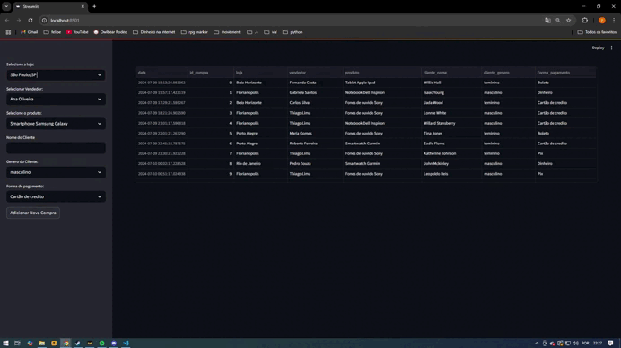
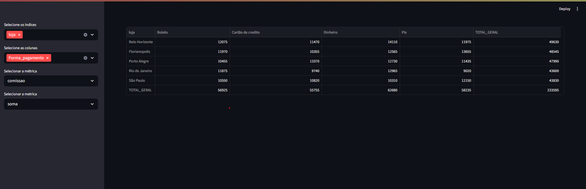

# 📊 Pandas + Streamlit | Projetos de Estudo

Bem-vindo ao repositório **Pandas + Streamlit - Treino**!  
Aqui você encontra pequenos projetos desenvolvidos para praticar **manipulação de dados com Pandas** e **criação de interfaces interativas com Streamlit**.  

Cada projeto é independente, focado em um conceito ou funcionalidade prática.

---

## 🧩 Projetos incluídos

| Arquivo                          | Descrição                                                                 |
|----------------------------------|---------------------------------------------------------------------------|
| `app_cadastramento.py`           | Formulário simples para cadastro de dados e visualização em tabela       |
| `app_gera_datasets.py`           | Geração de datasets aleatórios para testes                               |
| `app_insights.py`                | Análise de dados e geração de estatísticas descritivas                    |
| `app_tabela_dinamica.py`         | Tabela dinâmica com filtros por coluna (como um mini Power BI)           |
| `app_visualizar_colunas.py`      | Interface para selecionar e visualizar colunas específicas de um dataset |

---

```
## 🗂 Estrutura de pastas

pandas-streamlit-Treino/
│
├── app_cadastramento.py
├── app_gera_datasets.py
├── app_insights.py
├── app_tabela_dinamica.py
├── app_visualizar_colunas.py
├── datasets/ # Arquivos CSV/XLSX utilizados nos projetos
├── assets/ # GIFs ou imagens dos apps em execução
├── requirements.txt # Lista de dependências
└── README.md
```
---

## 🚀 Como executar os projetos

### 1. Clone o repositório

```bash
git clone https://github.com/FelipePacheco2/pandas-streamlit-Treino.git
cd pandas-streamlit-Treino
```
2. Instale as dependências
Recomendo usar um ambiente virtual:
```
python -m venv venv
venv\Scripts\activate  # Windows
# ou
source venv/bin/activate  # Mac/Linux
pip install -r requirements.txt
```
3. Execute um dos apps
streamlit run app_nome.py





📁 Sobre os dados
Os arquivos de dados usados nos projetos estão na pasta datasets/.
Eles são carregados nos apps com caminho relativo, por exemplo:

📌 Objetivo
Este repositório serve como um laboratório pessoal de testes e estudos, com foco em:
Manipulação de dados com Pandas
Desenvolvimento de aplicações web interativas com Streamlit
Organização de projetos reais em Python
Boas práticas de estrutura de repositório

👋 Contato
Feito com ❤️ por @FelipePacheco2
---

